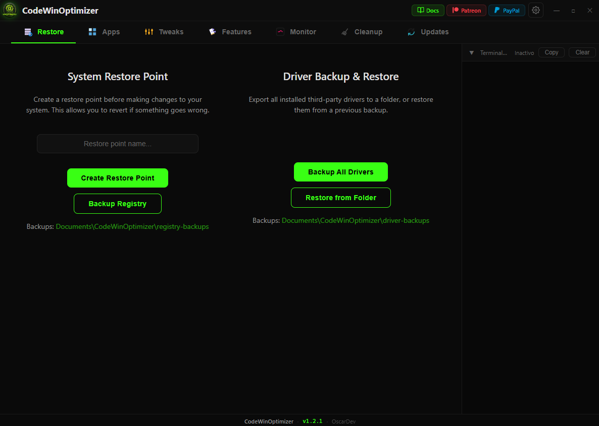
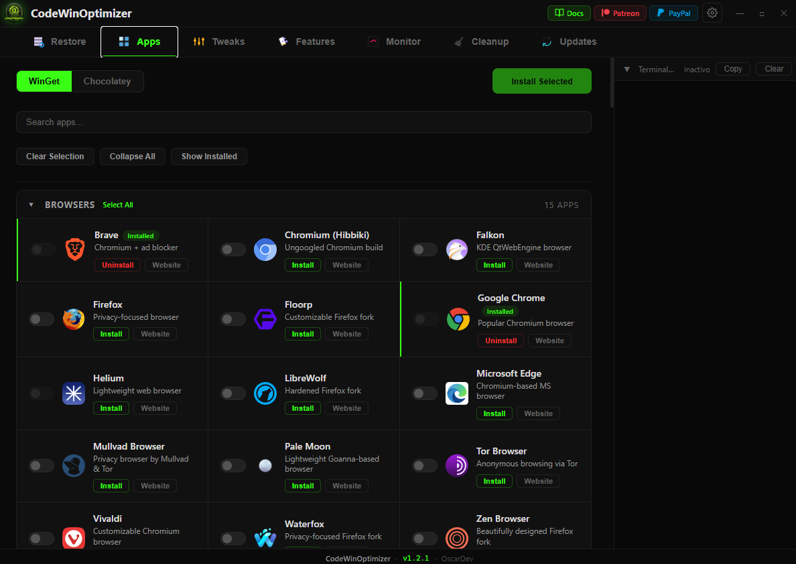
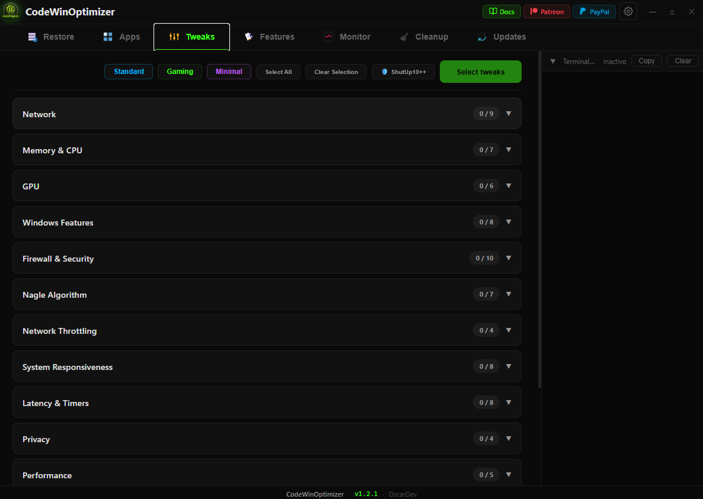
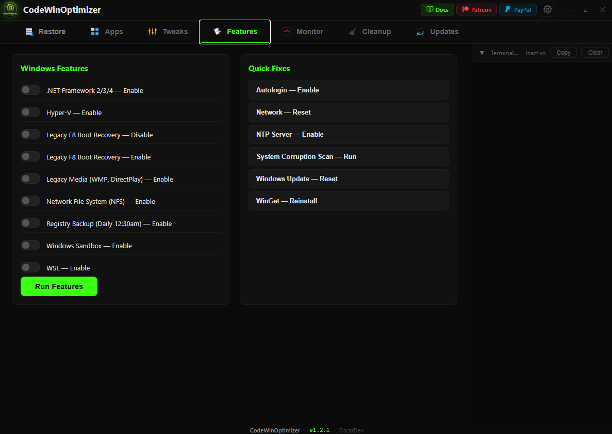
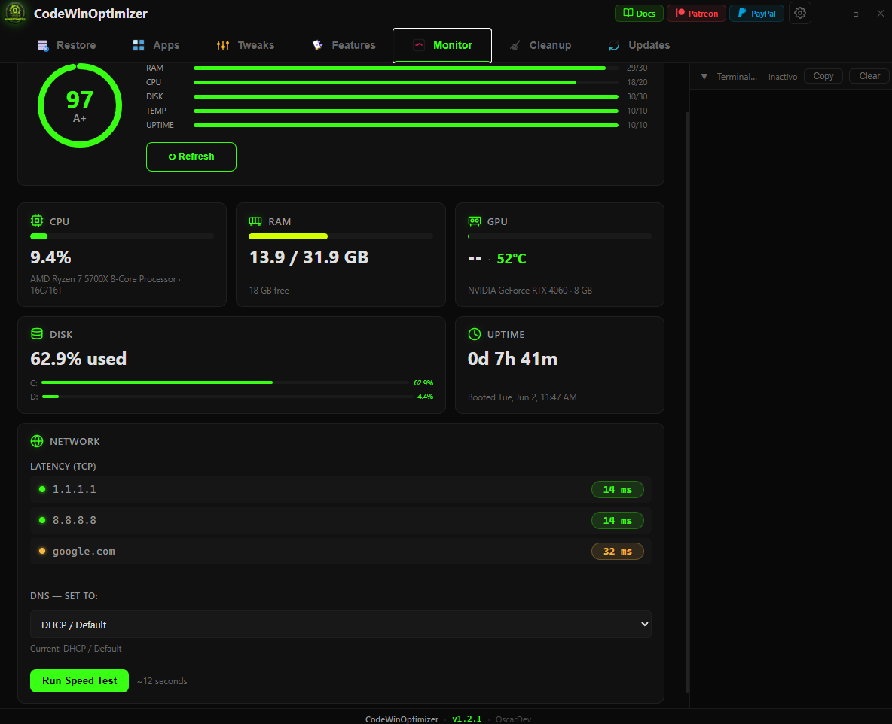
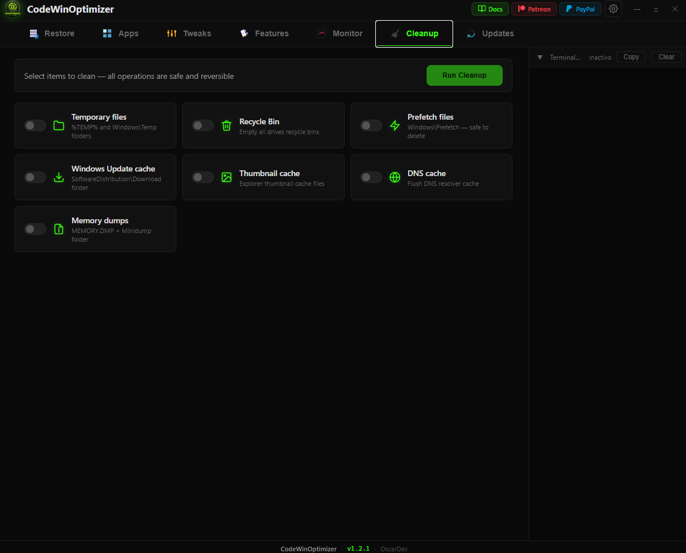
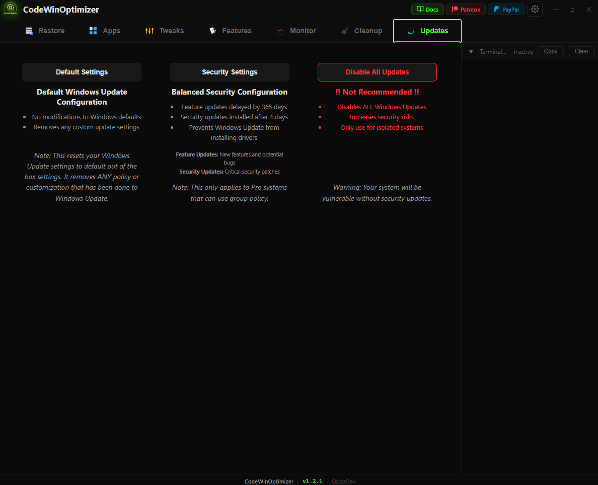
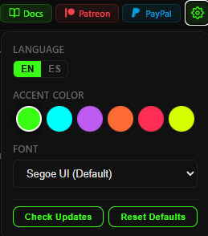
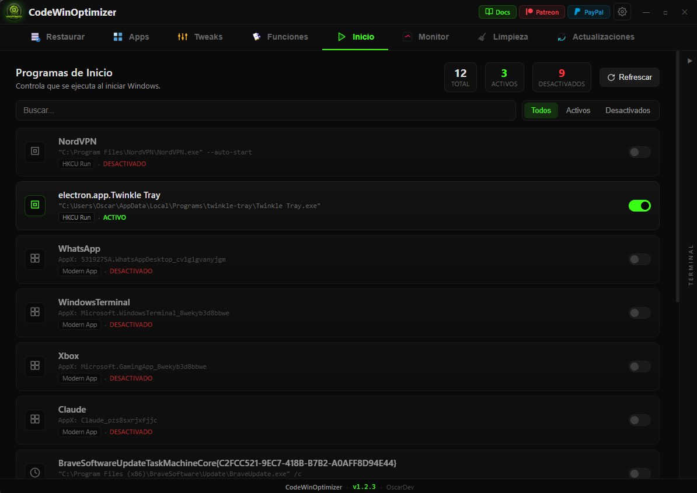

<p align="center">
  
</p>

# CodeWinOptimizer

[](https://codewinoptimizer.com/docs) [](https://github.com/oscarxdev/CodeWinOptimizer-App)

Windows optimization & customization tool — 171 apps, **140+ tweaks**, real-time monitor, disk cleanup, network speed test, driver backup, and quick-apply tweak presets — all in a single portable .exe.

Built with [Wails v2](https://wails.io/) — Go backend + HTML/CSS/JS frontend rendered in WebView2.

> **Auto-elevates to Administrator** on launch. Most features (registry, DISM, bcdedit, WinGet) require admin privileges.

> **Antivirus notice:** This tool uses PowerShell, DISM, WMI, and registry commands. Some antivirus may flag the .exe as suspicious (heuristic/AI false positives). All code is open source — [review the source](https://github.com/oscarxdev/CodeWinOptimizer-App) or build it yourself with `wails build`.

---

## Quick Install

Open **PowerShell as Administrator** and run:

```powershell
irm "https://codewinoptimizer.com/win" | iex
```

That single command downloads the latest release from GitHub to `%TEMP%` and launches it with elevation. No installation, no manual download — always the latest version.

Prefer a manual download? Grab the `.exe` from the [latest release](https://github.com/oscarxdev/CodeWinOptimizer-App/releases/latest).

---

## Preview

<details><summary>Click to expand</summary>

| Restore                          | Apps                          |
| -------------------------------- | ----------------------------- |
|    |    |

| Tweaks                           | Features                      |
| -------------------------------- | ----------------------------- |
|     |  |

| Monitor                          | Cleanup                       |
| -------------------------------- | ----------------------------- |
|    |  |

| Updates                          | Settings                      |
| -------------------------------- | ----------------------------- |
|    |  |

| Startup Manager                  |                               |
| -------------------------------- | ----------------------------- |
|    |                               |

</details>

## Features

### 🔧 Restore

- **Create System Restore Point** with custom name — bypasses the Windows 24h cooldown via registry tweak + WMI
- **Full Registry Backup** — exports all 5 hives (HKLM, HKCU, HKCR, HKU, HKCC) to `.reg` files in `Documents\CodeWinOptimizer\registry-backups\`
- **Driver Backup & Restore** — export all third-party drivers via DISM, restore via pnputil. Backups saved to `Documents\CodeWinOptimizer\driver-backups\`
- Backups folder opens automatically after completion

### 📦 Apps

- **171 apps** across 7 categories: Navegadores, Multimedia, Desarrollo, Juegos, Comunicacion, AI, Utilidades
- Install/Uninstall via **WinGet** or **Chocolatey** (auto-installs Choco if missing)
- Per-category "Select All / Deselect All"
- Each app has **Website** link and **Uninstall** button
- Toggle switches instead of checkboxes
- **Detects already installed apps** (green badge + border)
- **Search bar** and **collapsible categories** for quick navigation
- Toolbar: **Clear Selection**, **Collapse All**, **Show Installed** filter, **Selected count**

### ⚡ System Tweaks (140+)

- **14 categories** organized by use case:
  - 🌐 Network, 🧠 Memory, 🎮 GPU, ⚙️ Windows Features
  - 🛡️ Firewall & Security, 🔧 Nagle Algorithm, 📊 Network Throttling
  - ⚡ System Responsiveness, ⏱️ Latency Timers
  - 🔒 Privacy, 🚀 Performance, 🖥 UI & Bloat Removal
  - ✅ **Essential Tweaks** — safe optimizations for any user
  - ⚠️ **Advanced Tweaks — CAUTION** — deeper system changes
- Toggle switches per tweak with **impact badges** (low/medium/high)
- Single-column accordion layout with scroll when expanded
- **Clear Selection** button to deselect all tweaks with one click

### 💾 Quick Presets

Three one-click presets in the Tweaks toolbar that pre-select a curated set of tweaks:

- 🔵 **Standard** — 15 safe essential tweaks (privacy, performance, bloat removal)
- 🟢 **Gaming** — 22 tweaks optimized for maximum gaming performance
- 🟣 **Minimal** — 20 tweaks for the cleanest possible Windows install

### 🛠 Features

- **Windows Features:** Enable/disable .NET Framework, Hyper-V, WSL, Sandbox, NFS, F8 Boot Recovery, Legacy Media, scheduled registry backup
- **Quick Fixes:** Autologin, Network Reset, NTP Sync, SFC/DISM Scan, Windows Update Reset, WinGet Reinstall
- Execute selected features or individual fixes with terminal logs

### 🚀 Startup Manager (Inicio)

Full visibility and control over every Windows auto-start entry, in one place:

- **Run keys** — HKLM, HKCU and WOW6432Node (32-bit on 64-bit Windows)
- **Startup folders** — user (`shell:startup`) and all-users (`shell:common startup`)
- **AppX UWP startup tasks** — Claude, Windows Terminal, WhatsApp, Xbox, etc. Detected by parsing every `AppxManifest.xml` for `<Extension Category="windows.startupTask">` in any namespace
- **Scheduled tasks** with Logon / Boot triggers (outside `\Microsoft\Windows\*`) — browser updaters, vendor tools, etc.
- Per-item toggle uses the exact same `StartupApproved` binary that Task Manager writes — fully reversible, and shows the same state in Task Manager
- **Search**, filter (all / on / off), per-row type icons, live summary counts

### 📊 Monitor

- **Impact Dashboard** at the top of the tab — shows how the system evolves between visits with persisted snapshots (rolling 60 entries, atomic write to `%LOCALAPPDATA%\CodeWinOptimizer\impact.json`). Delta-first metric cards for Disk Free, Startup Programs, Running Services and Processes — color-coded vs the previous snapshot
- **Real-time system dashboard** with 3-second auto-refresh
- **CPU:** usage %, model name, cores/threads (gopsutil native)
- **RAM:** used/total GB with gauge bar (gopsutil)
- **GPU:** usage %, VRAM, temperature via nvidia-smi (NVIDIA GPUs)
- **Disks:** per-drive usage with color-coded bars (green/yellow/red)
- **Temperatures:** GPU temp (nvidia-smi), WMI thermal zones
- **Uptime:** days/hours since last boot
- **Network Latency:** TCP ping to 1.1.1.1, 8.8.8.8, google.com
- **Speed Test:** Professional Speedtest.net measurement via [speedtest-go](https://github.com/showwin/speedtest-go) — ping, download/upload speeds
- **DNS Selector:** Switch DNS servers directly from the app — Google, Cloudflare, Cloudflare Malware, Cloudflare Malware+Adult, OpenDNS, Quad9, AdGuard (Ads/Trackers), AdGuard Full — or reset to DHCP

### 🔄 Updates

- **3 modes to control Windows Update behavior:**
  - **Default Settings** — Reset all Windows Update policies to out-of-the-box defaults, remove any customizations, restore wuauserv service
  - **Security Settings** — Delay feature updates 365 days, install security updates after 4 days, block driver installations via Windows Update (Pro/Enterprise group policy)
  - **Disable All Updates** — Completely disable Windows Update service (with confirmation dialog due to security risk)

### 🧹 Cleanup

- **7 cleanup tasks:** Temp files, Recycle Bin, Prefetch, Windows Update cache, Thumbnails, DNS cache, Memory dumps
- Toggle switch selection per task
- Reports MB freed per task in terminal
- Auto-deselects after completion

### 🎨 Appearance

- **6 accent colors:** Neon Green (default), Cyan, Purple, Orange, Pink, Yellow
- **6 font choices:** Segoe UI, Cascadia Code, Inter, JetBrains Mono, Arial, Trebuchet MS
- Live preview + persistent via localStorage

### 💻 Terminal

- Real-time command output logging
- **Collapsible** — minimized by default, auto-expands on activity
- **Copy** button to clipboard
- **Clear** button

---

## How to Run

### Prerequisites

- [Go](https://go.dev/doc/install) 1.20+
- [Wails](https://wails.io/docs/gettingstarted/installation) v2
- Windows 10/11 with WebView2 runtime

### Bundled third-party binary (required for build)

The app embeds **O&O ShutUp10++** at compile time via `//go:embed assets/OOSU10.exe` so the "ShutUp10++" toolbar button works out of the box. The binary is **not** redistributed in this repo (third-party freeware, `.exe` is in `.gitignore`).

If you build from source, download it manually before running `wails dev` or `wails build`:

1. Download `OOSU10.exe` from the official site: <https://www.oo-software.com/en/shutup10>
2. Place it at `assets/OOSU10.exe` (create the `assets/` folder if missing)
3. Then run `wails dev` / `wails build` as usual

Without this file the Go compiler will fail with `pattern assets/OOSU10.exe: no matching files found`.

### Development (live reload)

```bash
wails dev
```

### Build executable

```bash
wails build
```

Output: `build/bin/CodeWinOptimizer.exe`

### Usage

1. Run `CodeWinOptimizer.exe` **as Administrator**
2. (Recommended) Create a restore point first — type a name and click "Create Restore Point"
3. Use any tab: install apps, apply tweaks, run features/fixes
4. All operations are logged in the terminal

---

## Tech Stack

| Layer            | Technology                                       |
| ---------------- | ------------------------------------------------ |
| Backend          | Go + Wails v2 runtime                            |
| Frontend         | Vanilla JS, CSS (dark theme, neon green #39ff14) |
| Window           | WebView2 (embedded Edge Chromium)                |
| Package managers | WinGet, Chocolatey                               |
| System tools     | PowerShell, DISM, bcdedit, reg.exe, nvidia-smi   |
| Monitoring       | gopsutil (CPU/RAM), nvidia-smi (GPU), WMI        |
| Speed Test       | speedtest-go (Speedtest.net)                     |

---

## Roadmap

<details><summary>Click to expand</summary>

### Completed

**v1.2.3 — Startup Manager + Impact Dashboard**

- [x] New **Inicio** tab — Startup Manager listing every auto-start entry: Run keys (HKLM/HKCU/WOW6432Node), Startup folders (user + all-users), AppX UWP startup tasks (Claude, Terminal, WhatsApp, Xbox, etc.) and scheduled tasks with Logon/Boot triggers
- [x] Per-item toggle uses `StartupApproved` binary registry value (same mechanism as Task Manager) — fully reversible
- [x] Search, filter (all/on/off), per-row type icons, summary counts
- [x] New **Impacto** panel at the top of the Monitor tab — surfaces how the system evolves between visits with persisted snapshots (rolling 60 entries, atomic write to `%LOCALAPPDATA%\CodeWinOptimizer\impact.json`)
- [x] Delta-first metric cards: Disk Free, Startup Programs, Running Services, Processes — color-coded vs the previous snapshot
- [x] Reworked Updates tab — structured cards with icons, badges and CTA buttons (neutral / recommended / danger treatments)
- [x] Monitor logic extracted to `js/monitor.js` (main.js shrunk ~440 lines)
- [x] Responsive titlebar that survives narrow window widths; double-click on the titlebar toggles maximize; active tab scrolls into view when the tab strip overflows

**v1.2.2 — Installer + Profile Refactor**

- [x] One-line web installer: `irm "https://codewinoptimizer.com/win" | iex`
- [x] Installer channels: `/win-beta` and `/win-dev` for pre-releases
- [x] SHA256 checksum verification in the installer (graceful fallback when missing)
- [x] Simplified Tweaks: removed Save/Load Profile UI, kept the 3 quick preset buttons
- [x] New Quick Install section in README + landing hero with copy-paste command
- [x] Rebranding to GitHub user `oscarxdev` across both repos

**Earlier**

- [x] System Restore Point creation (registry bypass for 24h cooldown)
- [x] Full registry backup to .reg files (5 hives)
- [x] App manager — install/uninstall via WinGet & Chocolatey (171 apps, 7 categories)
- [x] Installed app detection via winget list (green badge + border)
- [x] Apps toolbar: Clear Selection, Collapse All, Show Installed filter, Selected count
- [x] **140+ system tweaks across 14 categories** (network, GPU, memory, privacy, performance, essential, advanced...)
- [x] Windows Features manager — .NET, Hyper-V, WSL, Sandbox, NFS, etc.
- [x] Quick Fixes — network reset, NTP sync, SFC/DISM scan, Windows Update reset, WinGet reinstall, autologin
- [x] Portable mode — no installation required, single .exe
- [x] Terminal with real-time logs, collapsible, copy to clipboard
- [x] Custom frameless titlebar with min/max/close
- [x] Toggle switches UI, language selector ES/EN
- [x] Per-category Select All / Deselect All with collapsible categories
- [x] Custom theme editor — 6 accent colors, 6 fonts, persisted via localStorage
- [x] System monitoring dashboard — CPU, RAM, GPU (usage/temp/VRAM), disks, temps, uptime
- [x] Disk cleanup & temp files removal (7 tasks)
- [x] Auto-elevate to Administrator on launch (UAC prompt)
- [x] Network latency monitor (TCP ping)
- [x] **Network speed test** (Speedtest.net via speedtest-go)
- [x] **Driver backup & restore** (DISM export + pnputil restore)
- [x] **3 quick preset buttons** in Tweaks toolbar: Standard, Gaming, Minimal
- [x] Clear Selection button for tweaks
- [x] **DNS selector** in Monitor tab (9 providers + DHCP reset)
- [x] **Updates tab** — Default Settings, Security Settings, Disable All Updates modes

- [x] **Microsoft Tools category** — .NET SDK 6/8/9/10, Sysinternals (TCPView, RDCMan, Process Monitor, Process Explorer), PowerShell 7, PowerToys, NTLite, NuGet, DISMTools, OneDrive
- [x] **Install/Uninstall button** auto-switches based on installation state (green Install / red Uninstall)
- [x] **Bundled O&O ShutUp10++** — extract & launch from toolbar, no manual download
- [x] **Post-apply restart prompt** with cancellable 10-second shutdown
- [x] **Global footer** showing CodeWinOptimizer · v{version} · OscarDev
- [x] **Resizable side-docked terminal** with drag handle, width persisted in localStorage
- [x] **Sticky toolbars** in Tweaks and Apps tabs
- [x] **Per-category X/Y badges** with neutral/amber/green states based on selection progress

</details>
